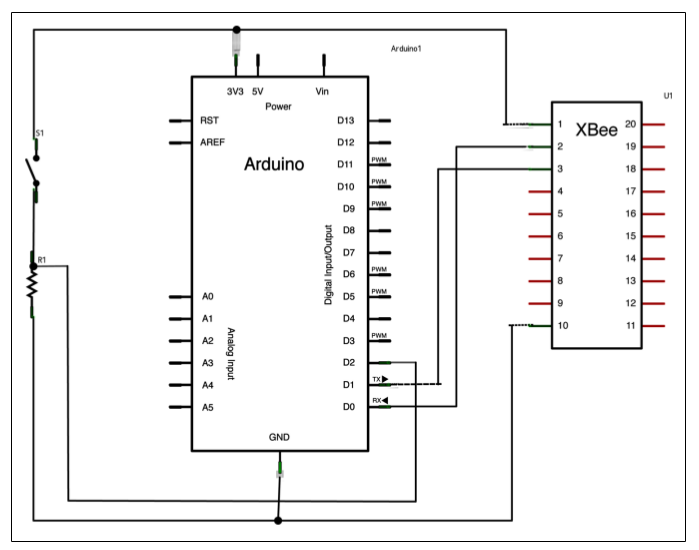

#### Xbee:

* This is the xbee:


* List of pins:


#### Arduino Uno & Xbee Hack:

Xbee | Uno
-----|-----
1 | Vcc 3.3v
2 (TX) | 1 (TX)
3 (RX) | 0 (RX)
10 | GND


#### Xbee Revelations pins:

Stick the **Anode** (+) side of a LED into specifc pins of Xbee module and **Cathode** (-) into GND.

* __13__: Getting power and currently awake.
* __15__: 
    - Light steadily while the radio searches for a network.
    - Blink one it has associated itself with one.
    - Coordinator always blink. (Different than Router and End Device.)
* __6__: 
    - Received Signal Strength Indicator (__RSSI__).  
    - Light up when receives information that is addressed to it.  
    - 10s light up after it receives info.  
    - Signal Strong -> Brighter light (vice-versa).


#### picocom

* used command:
```
picocom --echo --imap crcrlf /dev/---
```

* To exit:
```
(ctrl + A) + (ctrl + x)
```

- CR: Carriage Return '\r'  
    Reset a device's position to the beginning of a line text.
- LF: Line Fee '\n'

* __crcrlf__: maps __CR__ to __CR + LF__
* __crlf__: maps __CR__ to __LF__


* List of commands:

Command | Description
--------|-------------
+++ | Enter command mode
ATCN | Drop from command mode
AT | Are you there?
ATID | Show or Assign PAN ID
ATDH, ATDL | Show or Assign Destination address
ATSH, ATSL | Show or Assign Source address
ATRE | Factory default configuration
ATWR | Write configurtion (save)
ATMY | Show MY address (16 bits)
ATVR | Show which type the xbee is configured on. 20xx: Coordinator, 22xx: router, 28xx: End device
ATJV1 | Ensure that your router attempts to rejoin the coordinator on startup.


Eg.
PANID: 51
Coordinator:
    - SH: 13A200
    - SL: 40E3DB83
Router:
    - SH: 13A200
    - SL: 40EAEC2A


> PS:
> - Always verify: DH, DL, PAN
> - If using Arduino Uno Hack, you should rest the xbee by removing VCC from xbee module and clicking the reset button of Arduino board.
> - Do not upload initial configuration to the Arduino board with the __TX__ and __RX__ pins connected to it.
> - If the xbee is not responding at all, procceed to the XCTU > Tools > Xbee Recovery
> The XCTU program must be opened with a root permission.
> Product Family: **XB24**
> Optional: **Z7**
> Select **XB24-ZB**.


The communication will be from **Coordinator** to **Router** or **End Device**.

Arduino UNO LEDs:

* RX -> pin0
* TX -> pin1
* L -> pin13

---

#### Doorbell:

* Part of the Button
* Xbee in this part is set to coordinator
* The resistor is 10K ohm


> Code will be under `arduino_button` directory.

* Part of the piezo
* Xbee in this part is set to router


> Code will be unde `arduino_piezo` directory.


---

#### Xbee Direct:

> Xbee Direct <-> Exploratory data analysis.

* There are 10 pins that can be configured either as digital inputs/outputs. 

* Xbee S2 doesn't support __analog output__ (can't dim a LED).

* Xbee stand alone doesn't support any kind of _logic_, it only supports transmiting data and changing the sate of digital pins.


> Other Xbee radios incorporates a second microcontroller to allows some local logic.


---

#### Xbee I/O Features:


* Input/Output pin names:

Pin name | Physical pin # | AT command | Other functions
---------|----------------|------------|-----------------
DIO0, AD0 | 20 | D0 | Analog input, Commissioning Button
DIO1, AD1 | 19 | D1 | Analog input
DIO2, AD2 | 18 | D2 | Analog input
DIO3, AD3 | 17 | D3 | Analog input
DIO4  | 11 | D4 | 
DIO5 | 15 | D5 | Association indicator 
DIO6 | 16 | D6 | RTS
DIO7 | 12 | D7 | CTS 
(DIO8) | 9 | None | Pin sleep control, DTR 
(DIO9) | 13 | None | On/Sleep indicator
DIO10 | 6 | P0 | Received Signal Strength Indicator (RSSI)
DIO11 | 7 | P1 |
DIO12 | 4 | P2 | 


* AT Configuration:

- __ATD0 .. ATD7__:  
    Configures pins 0 through 7 for I/O mode.
    The command is followed by a numeric code that indicates whether the pin is tasked with digital input, output, analog input (pins 0 to 3 only), some other function, or nothing at all.

- __ATP0 .. ATP1__:  
    Configures pins 10 and 11 for I/O mode (there's a P3 for pin 12).
    The command is followed by a numeric code that indicates whether the pin will serve, digital in, digital out, or nothing.

- __ATIR__:  
    This sets the I/O sample rate, how frequently to report the current pin state and transmit it to the destination address.  
    The rate is set in milliseconds, using _hexadecimal_ notation.  
    To disable periodic sampling, set __ATIR__ to zero.

    If you want to take a sample 10 times every second. There are 1,000 milliseconds in a secondd so we divide this by 10 to get 100 milliseconds, (which is 0x64). Thus the command will be _ATIR64_.


> Always __write__ the configuration to firmware using __ATWR__.


* I/O settings codes:

ATDx or ATPx followed by | purpose
-------------------------|---------
0 | Disables I/O on that pin
1 | Built-in function, if available on that pin
2 | Analog input, only on pins D0 through D3
3 | Digital input
4 | Digital output, low (0 volts)
5 | Digital output, high (3.3 volts)


Eg.
ATD23 -> Configure pin2 as a digital input.
ATP15 -> Configure pin11 as digital output


* Analog input pins D0 - D3 read a range from 0V to 1.2V maximum.  
Voltages above 1.2V are ignored and result in the same maximum reading.  
You will ned to create a voltage divider circuit to keep it within the range of the analog-digital converter _ADC_.

The formula for voltage divider output between the two resistors is:


Eg.
If we have data comming as 3.3V, we will need R1 = 2\*R2.
R1 = 20k ohm
R2 = 10K ohm


Voltage Divider Circuit to map 3.3V range to 1.2V range.


* Advanced I/O Commands:

- __AT%V__:
    Returns the current supply voltage for the module.  
    Useful for keeping track of battery status.

- __ATIC__:
    Configures the digital I/O pins to monitor for changes in state.  
    Pins must be configured as digital inputs.  
    When change-detection is enabled, a sample is sent immediately any time a pin
    shifts from low to high or vice versa.

---

#### Light Sencor:


* Start by changing the **Firmware** of your Xbee coordinator to _API_ mode and not _AT_ mode, because I/O data is delivered only in API mode.


> Once a radio has been set to API mode, it can only be configured in X-CTU.
> Any other terminal program will not work.


* Xbee Coordinator Configuration:

- PAN ID: 51
- SH: 13A200
- SL: 40EAEC2A
- DH: 13A200
- DL: 40E3DB83


* Xbee Router Configuration:

- PAN ID: 51
- SH: 13A200
- SL: 40E3DB83
- DH: 13A200
- DL: 40EAEC2A

With a termial program:

* ATJV1
* ATD02 -> Set pin 20 to Analog input
* ATIR64 -> Set sample rate to 100 milliseconds (hex 64)
* ATWR


* Set your Xbee router to this layout:


* Set your Xbee coordinator to this layout:


---

#### API:


The Xbee has:

    * Transparent - Command mode: send/receive to/from radios - configuration (AT, ...).
    * Command mode: configuration (AT, ...).
    * API mode illimiate partialy the human interaction from Xbee's communication.


Transparent, command, and API modes with an XBee are **local** to that particular radio.  
It means that they apply to interactions with users, computers, or microcontrollers that take place via the XBee's serial connection.

Wireless communication between XBees are independent of the local interaction mode.


##### Protocols:

Every transfer of informtion requires a protocol.

> All common forms of serial communiaction break data up into bytes.


1. Start byte: A byte that indicates the beginning of a byte sequence.
2. Length byte: Length of data (payload).
3. Contents ID byte: The type of data in a particular frame.  
    Useful when sending more than one type of data.


- Frames, Packets, Envelops: metadata + payload

The metadata consist of 1., 2., 3., and even more things.


> Error-Correction Schemes: Detect but doesn't correct transmission error.

4. Appending _checksum_. Eg. **CRC** (Cyclic Redundancy Check).


##### XBee API Protocol:


The tiny microcontroller inside XBee radio doesn't have enough room to hold all the instructions for both AT mode and API mode.  

> Different firmware must be loaded onto the radio with X-CTU (Either AT or API).


* Basic API frame structure:

Start delimiter | Length | Frame data | Checksum
----------------|--------|------------|----------
Byte 1: 0x7E | Byte 2+3: MSB+LSB | Byte 4 .. n: API-specific structure | Byte n+1: Single byte


1. Start delimiter: 0x7E (126 in decimal).
2. Length: The length is described in 2 bytes (because the data frame could exceed the number that can be described in a byte).
    MSB (most significant byte), usually zero.
    LSB (least significant byte), usually contains the entire length.
    If the the length of the data is a large number, than the length is calculated by:
```
(MSB * 0xFF) + LSB
```
Eg.
MSB: 0x3
LSB: 0xDB
Length: (0x3 * 0xFF) + 0xDB = 0x3DB same as 987 in decimal.

3. Frame Data: This is the guts of the information.
4. Checksum: It is calculated based on all the bytes that came before it. It's a sum of all the bytes that made up the frame.

* Checksum formula (as in the official documentation:

    - To **calculate**: Not including frame delimiters and length, add all bytes, keeping only the lowest 8 bits of the result, and subtract the result from 0xFF.
    - To **verify**: Add all bytes (include checksum, but not the delimiter and length bytes). If the checksum is correct, the sum will equal 0XFF.


> Keeping the lowest 8 bits of the result is accomplished with a _bitmask_ operation (& 0xFF).
> You'd write a function in your program to do the whole checksum calculation for you.


