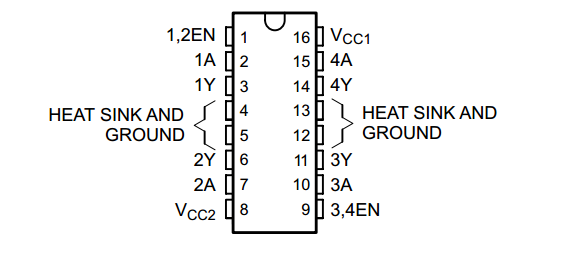
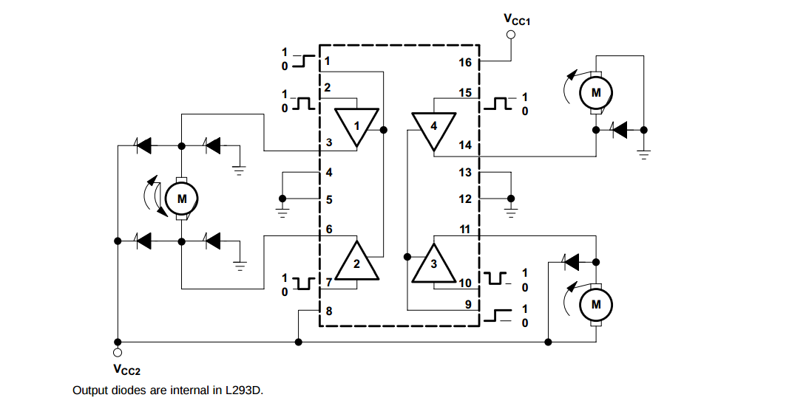
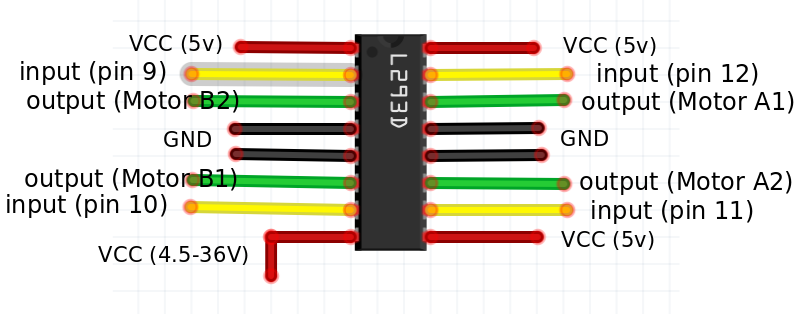

### Board Project:

* using **SM-42BYG011-25** stepper motors.
* Step Angle: 1.8 degree
* V: 12v
* A: 0.33A

* **Revolution**: 360° rotation
* **Steps per revolution**: 360° / step angle = 200steps

* Coil A:
    - A1: 11 (Green)
    - A2: 14 (Red)

* Coil B:
    - B1: 6 (Blue)
    - B2: 3 (Yellow)

* Using **L293DNE** to control the stepper motor:

Grps | pins | Description
-----|------|-------------
1, 2 EN | 1 | (Input) Enables driver channels 1 & 2 [active high input]
<1:4> A | 2, 7, 10, 15 | (Input) Driver inputs
<1:4> Y | 3, 6, 11, 14 | (Output) Driver outputs
3, 4 EN | 9 | (Input) Enables driver channels 3 & 4 [active high input]
GND | 4, 5, 12, 13 | To ground =D
VCC1 | 16 | 5v for internal logic translation
VCC2 | 8 | vcc for drivers 4.5v - 36v

