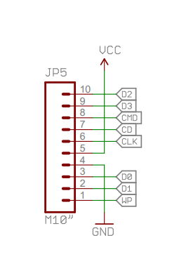

#### SD: Secure Digital

Two modes of communicating with an SD card:

* SD mode
* SPI mode

SD card comes up by default in 1-bit SD mode, but can changed into 4-bit mode after startup.

#### SPI: Serial Peripheral Interface

A synchronous serial communication interface specification used for short distance communication.

Using Sparkfun SD/MMC card with the following pins:

* SD mode:

name | description
-----|------------
CD/DAT3 | Card detection/Connector data line 3
CMD | Command/Response line 
Vss1 | GND 
Vdd | Power Supply
CLK | Clock
Vss2 | GND
DAT0 | Connector data line 0
DAT1 | Connector data line 1
DAT2 | Connector data line 2

* CD or CS (Chip Select)

On Arduino Uno pin n°:

* 13 -> CLK (Clock)
* 12 -> D0 (MISO)
* 11 -> CMD (MOSI)
* 10 -> D3 (Chip Select)

- WP: Write Protect

